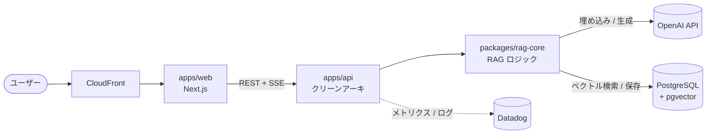
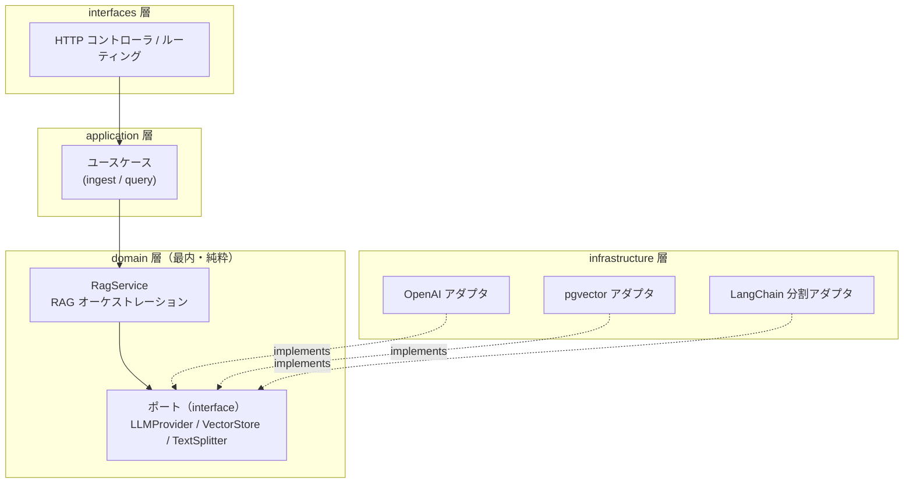
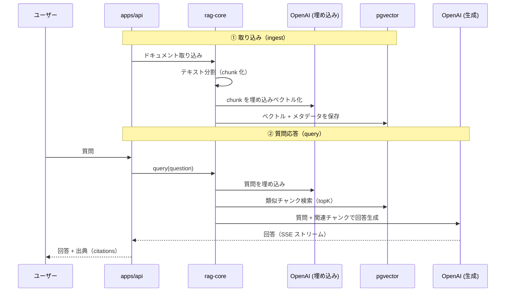

# medilex

医療ドキュメント（**薬剤添付文書**・**診療ガイドライン**）を **RAG（Retrieval-Augmented Generation）** で検索・質問応答できる Web アプリケーション。Turborepo によるモノレポで構築する。

> ⚠️ 本プロジェクトは開発初期段階です。本番運用に向けた医療情報の正確性検証・出典明示・監査要件は今後整備します。生成された回答は必ず一次情報（添付文書・ガイドライン原本）で確認する前提です。

---

## 開発方針

### クリーンアーキテクチャ
- ビジネスロジック（RAG 処理）を**ドメイン層に閉じ込め**、フレームワークや外部サービスから独立させる。
- **LLM・埋め込み・ベクトルストアは「外部依存（ポート）」として抽象化**し、実装を差し替え可能にする。
  - 例: OpenAI → 別の LLM プロバイダ、pgvector → 別のベクトル DB へ、ドメイン層を変えずに交換できる。
- 依存方向は常に「外側 → 内側」（infrastructure / interfaces → application → domain）。内側は外側を知らない。

### データストア方針
- **pgvector は PostgreSQL の拡張**として利用し、新規の専用ベクトル DB は導入しない。
- 業務データとベクトルを同一 RDB に集約し、運用・バックアップ・整合性管理をシンプルに保つ。

### インフラ方針
- **AWS のリソースはすべて AWS CDK（IaC）で管理**する。手動構築をしない。
- 監視は Datadog に集約する。

### 進め方
- モノレポをステージごとに段階的に構築する（下記「進捗」参照）。
- 各ステージで `pnpm install` / 型チェック / ビルドが通る状態を保ちながら積み上げる。

---

## 技術スタック（予定）

| 領域 | 採用予定 | 備考 |
| --- | --- | --- |
| モノレポ管理 | **Turborepo** + pnpm workspace | タスクのキャッシュ・依存順実行 |
| ツールバージョン管理 | **mise** | node 24.16.0 (LTS) / pnpm 11.6.0 を固定 |
| 言語 | **TypeScript** | フロント・バック共通 |
| フロントエンド | **Next.js**（App Router） | `apps/web` |
| バックエンド | **Node.js + TypeScript** | `apps/api`、クリーンアーキ構成 |
| RAG コア | **LangChain.js** + OpenAI API | `packages/rag-core` にドメインロジックを集約 |
| LLM / 埋め込み | **OpenAI API** | ポート経由で差し替え可能 |
| ベクトル検索 | **PostgreSQL + pgvector** | 専用ベクトル DB は使わない |
| インフラ | **AWS**（ECS / RDS / S3 / CloudFront） | IaC は AWS CDK（`infra/cdk`） |
| 監視 | **Datadog** | |

---

## アーキテクチャ

### システム全体構成



### クリーンアーキテクチャの依存方向

依存は常に「外 → 内」。内側（domain）は外側を知らず、外部依存はポート（interface）で抽象化して差し替え可能にする。



> 矢印は依存方向。infrastructure のアダプタは domain のポートを **実装**する（依存性逆転）。これにより OpenAI → 別 LLM、pgvector → 別ストアへ、domain を変えずに交換できる。

### RAG のデータフロー



---

## モノレポ構成（予定）

```
medilex/
├── apps/
│   ├── web/          # Next.js（フロントエンド）
│   └── api/          # TypeScript バックエンド（クリーンアーキテクチャ）
├── packages/
│   ├── rag-core/     # LangChain.js + RAG ロジック（ドメイン中心）
│   ├── ui/           # 共通 UI コンポーネント
│   └── types/        # 共通型定義
└── infra/
    └── cdk/          # AWS CDK（IaC）
```

### `apps/api` のレイヤ構成（クリーンアーキテクチャ）
```
domain/         # エンティティ・ポート（インターフェース）・ドメインサービス
application/    # ユースケース（ドメインの呼び出しを組み立てる）
infrastructure/ # 外部依存の実装（DB・OpenAI・LangChain アダプタ）
interfaces/     # HTTP コントローラ・ルーティング（フレームワーク境界）
```

### `packages/rag-core` のポート（差し替え可能な外部依存）
- `LLMProvider` … 回答生成（OpenAI 実装を差し替え可能）
- `VectorStore` … ベクトル検索・保存（pgvector 実装）
- `TextSplitter` … ドキュメント分割（LangChain 実装）

---

## セットアップ

```bash
# ツール（node / pnpm）を mise で揃える
mise install

# 依存インストール
pnpm install
```

主要なコマンド（ルートから Turborepo 経由で実行）:

```bash
pnpm build       # 全パッケージをビルド（依存順）
pnpm dev         # 開発サーバ起動
pnpm typecheck   # 型チェック
pnpm lint        # Lint
```

環境変数は `.env.example` をコピーして `.env` を作成（OpenAI API キー / DATABASE_URL など）。

---

## 進捗（段階的構築）

- [x] **ステージ1**: Turborepo + pnpm workspace のルートセットアップ（mise でツール固定） ← *進行中*
- [ ] **ステージ2**: `packages/types` 共通型定義
- [ ] **ステージ3**: `packages/rag-core`（クリーンアーキ + LangChain.js + pgvector で RAG 最小動作）
- [ ] **ステージ4**: `apps/api` クリーンアーキ骨格
- [ ] **ステージ5**: `apps/web`（Next.js）+ `packages/ui` 最小スキャフォールド
- [ ] **ステージ6**: `infra/cdk` 骨組み
